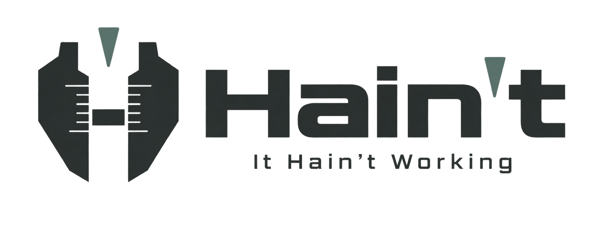
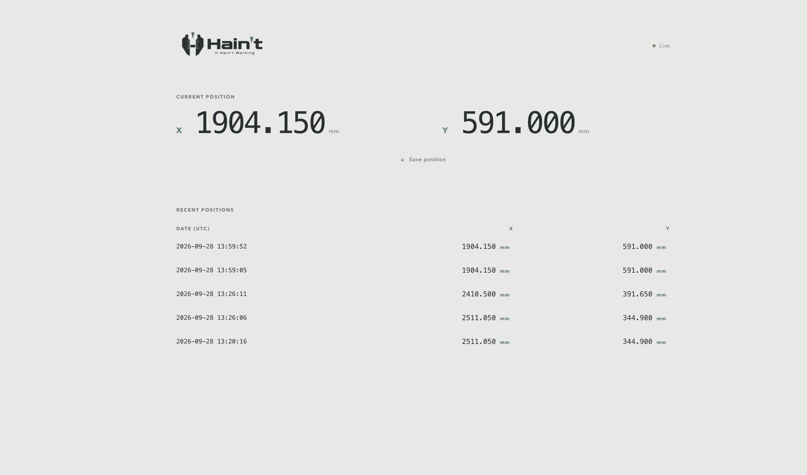

<p align="center">
  
  <br>
  <a href="https://github.com/AngelaDMerkel/Hain-t/actions/workflows/tests.yml"></a>
</p>

Hain’t is a small, open-source position capture service for ACU-RITE/HEIDENHAIN digital readouts. It polls a DRO over USB, displays (nearly) live X/Y coordinates in a browser, and saves operator-selected positions to a timestamped SQLite database.



## Why this exists

Hain’t began life when my company was introduced to the pain of working with Heidenhain to receive their **HEIDENHAIN GAGE-CHEK Wedge** to serve a DRO300. Several weeks of back-and-forth resulted in a failing trial license and no transparent pricing for the software. German software has a way of overcomplicating the simple task of displaying and saving simple readout data.

GAGE-CHEK Wedge was a poor fit for the business: it is a Windows desktop product with a trial-license model, and its workflow focuses on transferring readings into Excel, the cursor, or a text field. Getting reliable data from the connected DRO300 proved far more difficult than it should have been. We needed a transparent tool that could run locally, expose an ordinary HTTP API, keep a durable audit trail, and later feed a separate engineering-validation stack.

Hain’t deliberately does less:

- polls the DRO instead of waiting for an operator to press **Send Position**;
- presents the current coordinates in a browser;
- saves a position only when the operator chooses to;
- persists measurements in an ordinary SQLite database;
- has no proprietary runtime, subscription, or trial period;

This project is independent of HEIDENHAIN and is not an official replacement or supported HEIDENHAIN product. ACU-RITE, HEIDENHAIN, DRO300, and GAGE-CHEK are trademarks of their respective owners. See the [official GAGE-CHEK Wedge product page](https://www.heidenhain.us/products/gage-chek-wedge/) and the [DRO203/DRO300 operating instructions](https://old.acu-rite.com/pdf/1221048-24_DRO_203_300_OI_en.pdf) for vendor documentation.

## Features

Hain’t is limited, but feature complete: reading a compatible DRO continuously, displaying its current coordinates, and saving selected positions with durable timestamps.

- Dockerized web application, JSON API, and SQLite database;
- automatic container health checks and restart policy;
- persistent Docker volume for saved measurements;
- active position polling at 4 Hz by default;
- nearly live X/Y display with stale-connection detection;
- synchronized X/Y snapshots with one UTC timestamp;
- a small, cross-platform pySerial bridge for USB serial access;
- an experimental native launcher for macOS, Windows, and Debian;
- a keyboard-driven terminal interface with live coordinates and saved-position history;
- configurable bind address, published port, CORS origin, serial port, baud rate, units, poll rate, and poll command;
- unprivileged application container with no proprietary runtime or package dependencies.

## Compatibility

| Component | Support |
| --- | --- |
| Docker Engine with Compose v2 | Supported |
| Docker Desktop | Supported |
| macOS native application | Experimental; Apple silicon and Intel builds |
| Windows native executable | Experimental; 64-bit build |
| Debian package | Experimental; 64-bit x86 build |
| ACU-RITE/HEIDENHAIN DRO300 | Tested over USB |
| ACU-RITE/HEIDENHAIN DRO203 | Uses the same documented external-operation protocol; hardware validation is pending |

The application stack runs as a standard Linux container wherever Docker Compose is available. The USB bridge runs beside Docker on the machine that physically owns the serial device and sends readings to the published HTTP endpoint. It uses the documented `Ctrl+B` current-position request by default and can alternatively send `ESC A0200 CR`, described in the DRO operating instructions as **Send actual position**.

## Requirements

- an ACU-RITE/HEIDENHAIN DRO with USB device support;
- a data-capable USB cable;
- Docker Engine or Docker Desktop with Compose v2;
- Python 3.11 or newer on the machine connected to the DRO.

The web service uses the Python standard library. The USB bridge uses
[pySerial](https://pyserial.readthedocs.io/) for consistent serial-port discovery and access on macOS,
Windows, and Linux.

## Recommended installation

**Docker Compose remains the recommended installation path.** It provides the most predictable
runtime, persistence, health checks, and upgrade path. The native GUI and TUI packages below are
experimental alternatives for environments where Docker is unavailable or undesirable.

Clone the repository, start the container, and run the USB bridge on the host:

```bash
git clone https://github.com/AngelaDMerkel/Hain-t.git
cd Hain-t
docker compose up --build -d
python3 -m venv .venv
source .venv/bin/activate
python -m pip install -r requirements.txt
python bridge/dro_bridge.py --port auto
```

In Windows PowerShell, activate the environment with `.venv\Scripts\Activate.ps1` and use `python`
in place of `python3`.

Open [http://localhost:8080](http://localhost:8080). The status should change to **Live**, and moving an axis should update the displayed coordinates within roughly half a second.

The included [`compose.yaml`](compose.yaml) accepts these optional values from the shell or a local `.env` file:

| Variable | Default | Purpose |
| --- | --- | --- |
| `HAINT_BIND_ADDRESS` | `127.0.0.1` | Host address that publishes the application |
| `HAINT_PORT` | `8080` | Published host port |
| `HAINT_CORS_ORIGIN` | `*` | Allowed browser origin for API requests |

For example:

```dotenv
HAINT_BIND_ADDRESS=0.0.0.0
HAINT_PORT=8090
HAINT_CORS_ORIGIN=http://inspection-console.example
```

If `HAINT_PORT` changes, pass the matching bridge endpoint, for example `--endpoint http://127.0.0.1:8090/api/live`. Bind to `0.0.0.0` only on a controlled network; the API does not provide authentication.

Use **Save position** to persist the displayed X/Y pair. Live polling stays in memory and does not create database rows. Stop the application with `docker compose down`; the `dro-data` volume remains intact.

## Direct install

To run without Docker, install the bridge dependency and start the combined desktop launcher:

```bash
python3 -m venv .venv
source .venv/bin/activate
python -m pip install -r requirements.txt
python -m desktop.launcher
```

The launcher starts the local service and serial bridge, opens the browser interface, and stores the
SQLite database in the operating system’s per-user application-data directory. Use
`.venv\Scripts\Activate.ps1` on Windows. Tkinter ships with the standard macOS and Windows Python
installers; Linux users may also need their distribution’s `python3-tk` package.

### Terminal interface

Run the complete application in a terminal instead:

```bash
python -m desktop.tui
```

The TUI polls the DRO, displays the current X/Y coordinates and recent saved positions, and uses the
same SQLite database as the graphical interface. Press `S` to save the current position, `B` to open
the browser interface, or `Q` to quit. It accepts `--serial-port`, `--http-port`, `--baud`, `--unit`,
`--poll-interval`, and `--poll-command`; set `NO_COLOR=1` or pass `--no-color` for plain output.

## Experimental native packages

These packages are optional evaluation builds; Docker Compose remains the recommended deployment.

The [Native builds workflow](https://github.com/AngelaDMerkel/Hain-t/actions/workflows/native-builds.yml)
produces four downloadable packages:

- a macOS `.app` for Apple silicon;
- a macOS `.app` for Intel Macs;
- a 64-bit Windows `.exe`;
- an `amd64` Debian `.deb` package.

Pushes to `main` and manual workflow runs retain the packages as temporary Actions artifacts. Pushing
a semantic version tag such as `v0.1.0` builds the same packages, generates SHA-256 checksums, and
publishes them as a permanent GitHub Release with generated release notes. The packages embed the web
service, interface, pySerial bridge, and desktop launcher; Docker and a separate Python installation
are not required. They are currently unsigned experimental builds, so macOS Gatekeeper or Windows
SmartScreen may require explicit approval before first launch.

Each archive also contains `haint-tui` (`haint-tui.exe` on Windows). The Debian package installs both
`haint` and `haint-tui` in `/usr/bin`.

The native launcher keeps all traffic on `127.0.0.1`, opens the browser interface automatically, and
stores `dro.sqlite3` under `%LOCALAPPDATA%\Haint` on Windows,
`~/Library/Application Support/Haint` on macOS, or `$XDG_DATA_HOME/Haint` on Linux. Advanced users can
run the packaged executable with `--serial-port PORT`, `--http-port PORT`, or `--no-browser`.

The reproducible package commands live in [`packaging/`](packaging/). Install
`requirements-build.txt`, then run the script for the current operating system. PyInstaller cannot
cross-compile, so each package must be built on its target operating system; the workflow supplies
the matching runners.

## USB access and Docker

The supported deployment intentionally keeps USB access out of the application container. [Docker documents that Docker Desktop does not support direct USB passthrough](https://docs.docker.com/desktop/troubleshoot-and-support/faqs/general/#can-i-pass-through-a-usb-device-to-a-container); its alternative is a more involved USB/IP setup. A host serial path such as `/dev/cu.usbmodem*` therefore cannot be passed through with an ordinary Compose `devices:` entry. Hain’t uses the simpler and more reliable boundary: the host bridge opens the serial device and posts readings to `http://127.0.0.1:8080/api/live`, while Docker owns the UI, API, and database.

Do not add a `devices:` mapping to the supplied `dro-utility` service: that image does not contain or run the USB bridge, so mapping a device into it will not produce readings. On a native Docker host, `devices:` is useful only for a separate collector container when the Docker daemon can already see the serial character device; that is not Hain’t’s supported topology.

Run `bridge/dro_bridge.py` on the USB-connected host instead. `--port auto` examines the serial-port
metadata and prefers a device identified as HEIDENHAIN, ACU-RITE, or DRO. Use `--port PATH` on macOS
or Linux, or `--port COM7` on Windows, to select a device explicitly. Do not let another program open
the same serial port concurrently.

## Bridge options

```text
--port PATH                 Serial path or "auto" (default: auto)
--baud RATE                 Serial baud rate (default: 115200)
--unit {mm,in}              Unit when the DRO output has no unit marker
--endpoint URL              Live-update endpoint
--poll-interval SECONDS     Request interval; 0 enables manual-send mode
--poll-command COMMAND      ctrl-b or actual-position
--retry-seconds SECONDS     Delay after disconnects or errors
--verbose                   Print every accepted axis update
```

Examples:

```bash
# Select a specific device on macOS or Linux
python3 bridge/dro_bridge.py --port /dev/cu.usbmodem12101

# Select a specific device on Windows
python bridge/dro_bridge.py --port COM7

# Poll twice per second
python3 bridge/dro_bridge.py --poll-interval 0.5

# Try the alternate documented position command
python3 bridge/dro_bridge.py --poll-command actual-position

# Receive only readings sent from the DRO controls
python3 bridge/dro_bridge.py --poll-interval 0
```

Do not run GAGE-CHEK Wedge, a serial terminal, or another collector against the same port at the same time. Serial devices normally permit only one active owner.

## Architecture

```text
┌────────────────────────────┐
│ DRO USB serial device      │
│ 115200 baud                │
└──────────────┬─────────────┘
               │ Ctrl+B every 250 ms
               ▼
┌────────────────────────────┐       HTTP/JSON       ┌──────────────────────────┐
│ Host USB bridge            │ ────────────────────▶ │ Hain’t container         │
│ bridge/dro_bridge.py       │     POST /api/live    │ UI, API, SQLite service  │
└────────────────────────────┘                       └─────────────┬────────────┘
                                                                 │
                                                    ┌────────────┴─────────────┐
                                                    ▼                          ▼
                                             Browser UI                 Docker volume
                                             localhost:8080             /data/dro.sqlite3
```

This boundary keeps hardware ownership simple: the host bridge owns the serial connection, and the portable container owns the UI, API, and database. The two components communicate through a small, documented JSON contract.

## Data behavior

The bridge receives lines such as:

```text
X =+  2087.65 R
Y =+   456.35 R
```

Each live axis update is normalized to:

```json
{
  "axis": "X",
  "value": 2087.65,
  "unit": "mm",
  "raw": "X =+  2087.65 R",
  "received_at": "2026-09-28T13:51:45.583492+00:00"
}
```

Live coordinates are held in memory. Pressing **Save position** writes the current X and Y values in one SQLite transaction; both rows receive the same `stored_at` timestamp and are displayed as one saved position.

## HTTP API

| Method | Path | Purpose |
| --- | --- | --- |
| `GET` | `/api/health` | Container health check |
| `GET` | `/api/live` | Latest in-memory axis values |
| `POST` | `/api/live` | Update one live axis value |
| `POST` | `/api/positions` | Persist the current live X/Y snapshot |
| `GET` | `/api/measurements?limit=100` | Read saved axis records, newest first |
| `POST` | `/api/measurements` | Persist one axis record directly |
| `GET` | `/api/status` | Saved-record count and latest record |

Save the current live position:

```bash
curl -X POST -H 'Content-Type: application/json' -d '{}' \
  http://localhost:8080/api/positions
```

Read recent saved records:

```bash
curl 'http://localhost:8080/api/measurements?limit=20'
```

The API currently has no authentication. Docker Compose binds it to `127.0.0.1` by default. Do not expose it to an untrusted network. For a controlled LAN deployment, set `HAINT_BIND_ADDRESS=0.0.0.0`, restrict `HAINT_CORS_ORIGIN`, and add appropriate network controls.

## SQLite data and backup

The database lives at `/data/dro.sqlite3` in the `dro-data` Docker volume. Records contain:

```text
id, axis, value, unit, raw, received_at, stored_at
```

Inspect recent records:

```bash
docker compose exec dro-utility python -c \
  "import sqlite3; c=sqlite3.connect('/data/dro.sqlite3'); print(c.execute('select * from measurements order by id desc limit 10').fetchall())"
```

Create a consistent SQLite backup:

```bash
docker compose exec dro-utility python -c \
  "import sqlite3; src=sqlite3.connect('/data/dro.sqlite3'); dst=sqlite3.connect('/data/backup.sqlite3'); src.backup(dst)"

docker compose cp dro-utility:/data/backup.sqlite3 ./backup.sqlite3
```

Native installations use the per-user data directory described under **Experimental native
packages**. Set `DATABASE_PATH` before launching Hain’t to place the database elsewhere.

## Troubleshooting

### The DRO powers on, but no serial device appears

Power alone does not prove that the cable carries data. Try another data-capable USB cable and port, then use the host’s device manager or serial-device listing to confirm that a port was created. On hosts that expose serial devices under `/dev`, check likely device paths with:

```bash
ls /dev/cu.usbmodem* /dev/ttyACM* /dev/ttyUSB* 2>/dev/null
```

The tested DRO identified itself as `HEIDENHAIN DRO`. Pass the discovered path with `--port PATH` if automatic discovery does not select it.

### Hain’t says “Waiting for DRO”

- confirm the bridge terminal is still running;
- make sure another program does not own the serial port;
- run the bridge with `--verbose` to inspect accepted readings;
- try `--poll-command actual-position` for different firmware;
- verify that the service responds at `http://localhost:8080/api/health`.

### Multiple serial devices are connected

Automatic detection intentionally stops rather than guessing. Pass the intended path explicitly with `--port`.

### The container is healthy but the DRO is unavailable

That is expected if only `docker compose up` is running. Start the USB bridge on the host; the application container intentionally does not open the serial device itself.

### Port 8080 is already in use

Set another `HAINT_PORT` value and use the matching bridge `--endpoint`, or stop the process already using the port.

## License

[MIT](LICENSE)
